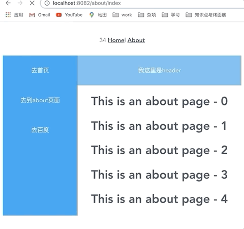

# Skeleton-screen-demo

半自动根据页面内容生成骨架屏
目的是不需要单独写改页面的骨架屏，根据当前页面内容布局，修改当前简化内容成为骨架容器，从而形成的骨架屏。

本 code 由学习参考 `page-skeleton-webpack-plugin` 为前提，目的提供学习自动化骨架屏原理，如有意可以前往观看其源码。
构建思路参考 `page-skeleton-webpack-plugin` 和 `vue-skeleton-webpack-plugin` 两个框架

## 文档说明

想了解该项目创建过程和思考可以参考对应的解说文档：

## 核心目录结构

```(filePath)
├── public
│   └── shell 存放生成骨架屏文件
├── nodeScript 启动服务端代码
├── skeletonjs 生成骨架核心代码
├── ske.js 启动生成骨架
```

启动：

1. npm run serve
2. npm run start:server

port: 8080/8082

更多执行请参考 `package.json`

## 预览



