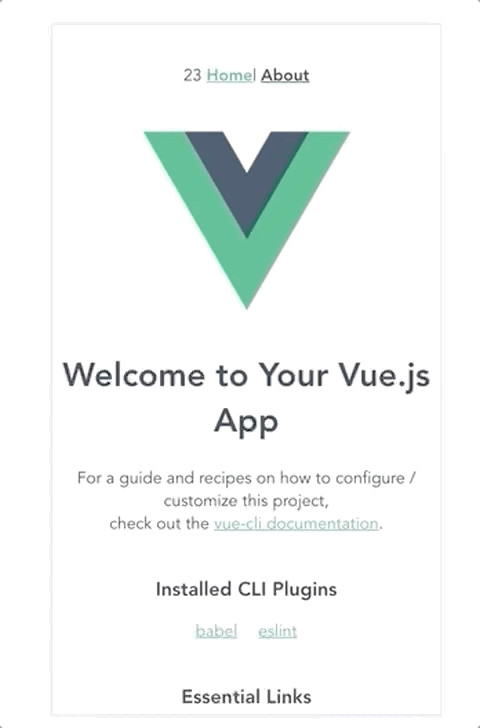

# Skeleton-screen-demo

半自动根据页面内容生成骨架屏
> 目的是在实现页面的简单骨架屏时无需再写额外的代码。根据当前页面内容布局，把当前内容切换为骨架容器，生成对应的html。

## 前提
构建思路基于 [page-skeleton-webpack-plugin](https://github.com/ElemeFE/page-skeleton-webpack-plugin) 和 [vue-skeleton-webpack-plugin](https://github.com/lavas-project/vue-skeleton-webpack-plugin) 两个框架所做的学习简化版。

> 本 code 由学习参考 `page-skeleton-webpack-plugin` 为前提，目的提供学习自动化骨架屏原理，如有意可以前往观看其源码。

## 文档说明

想了解该项目创建过程和思考可以参考对应的解说文档：

## 核心目录结构

```(filePath)
├── public
│   └── shell 存放生成骨架屏文件
├── nodeScript 启动服务端代码
├── skeletonjs 生成骨架核心代码
├── ske.js 启动生成骨架
```

启动：

1. npm run serve
2. npm run start:server

port: 8080/8082

更多执行请参考 `package.json`

## 预览



